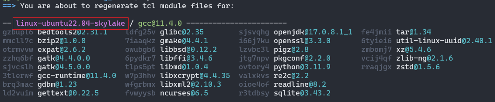
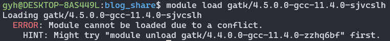

---
html:
    toc: true
    # number_sections: true # 标题开头加上编号
    toc_depth: 6
    toc_float:
        collapsed: false # 控制文档第一次打开时目录是否被折叠
        smooth_scroll: true # 控制页面滚动时，标题是否会随之变化
---

[toc]
___

# 前言
  在Linux安装软件，经常因为**权限**或者其他问题导致**依赖环境**难以安装。即使是普通用户通过[Spack](https://spack.io/)也可以实现**自动化安装软件及其依赖**，而Spack自己的spack load反响不如[environment module](https://modules.sourceforge.net/)方便，两者搭配，干活不累。

本文将带你从头安装这两个软件，并设置相关配置。

___

# 一、软件介绍

## 1.Spack

Spack是一款高性能包管理工具，支持软件不同版本，不同编译其及编译选项对安装包进行安装。

关于Spack的使用参考[Spack官方文档](https://spack.readthedocs.io/en/latest/)。

## 2.Environment Modules

Environment Modules是一款环境变量管理工具，通过module实现软件环境变量的管理，快速加载和切换软件环境。

关于Environment Modules的使用参考 [Environment Modules官方文档](https://modules.readthedocs.io/en/latest/)。

# 二、Spack安装

## 1.依赖环境

以Ubuntu22.04为例

```bash
sudo apt update
sudo apt install build-essential ca-certificates coreutils curl environment-modules gfortran git gpg lsb-release python3 python3-distutils python3-venv unzip zip
```

## 2.安装

从github下载软件包

```
# 这里我把软件安装到 $HOME/software中
mkdir software && cd software
git clone -c feature.manyFiles=true https://github.com/spack/spack.git
```

## 3.激活Spack

```bash
. $HOME/software/spack/share/spack/setup-env.sh # 注意开头的 . 后边有个空格
# 或者
source $HOME/software/spack/share/spack/setup-env.sh # 也可以把这句加到 ~/.bashrc中，登录自动激活Spack
```

## 4.测试安装软件

这里我安装了两个软件bedtools和gatk，而gatk有4.4.0.0和4.5.0.0两个不同的软件版本。

```bash
spack install -j 8 bedtools2    # -j 8 多线程运行，加速安装过程
spack install -j 8 gatk@4.5.0.0 
spack install -j 8 gatk@4.4.0.0
```

## 5.配置

1）修改module配置

```bash
spack config edit modules
```

编辑内容如下

```
modules:
  default:
    enable: [tcl] # 以后用Spack安装的软件都会自动用tcl生成对应的Module的文件
    tcl:
      hide_implicits: true # 隐藏依赖包，module av就只显示主要的软件，不会显示依赖包
      all:
        autoload: direct # or `run`
        conflict:
          - '{name}' # 同名软件冲突，检测同名软件是否已经加载
    lmod:
      hide_implicits: true # 隐藏依赖包，module av就只显示主要的软件，不会显示依赖包
      all:
        autoload: direct # or `run`
        conflict:
          - '{name}' # 同名软件冲突，检测同名软件是否已经加载
```

详细配置参考[官方Spack Module配置](https://spack.readthedocs.io/en/latest/module_file_support.html)。 

 2）生成Environment Modules可用的module 文件。

```bash
spack module tcl refresh --delete-tree
```

会出现以下内容。红线框起来的部分，每个人可能不一样，记住你自己是什么样的。



```bash
# 提示
Do you want to proceed? [y/n] y # 输入y确认 
```

如果你以后又修改了spack的module配置，都需要重新运行这个命令，才能让新配置生效。 

# 三、Environment Modules安装

## 1.下载软件包

此处建议用最新版，module 3.x配置的时候有些问题。

```bash
curl -LJO https://github.com/cea-hpc/modules/releases/download/v5.4.0/modules-5.4.0.tar.gz
tar xfz modules-5.4.0.tar.gz
```

## 2.安装依赖

如果后边安装报错，参考官网[安装说明](https://modules.readthedocs.io/en/latest/INSTALL.html)“Requirements”，看看你缺哪项

一般大概率会缺失tcl-devel>=8.5

```bash
sudo apt-get install tcl-devel
```

## 3.安装

```bash
./configure   # 可以设置--prefix=/path/to/your/file指定安装位置
make -j 4     # -j 4 代表多线程编译，可以加快安装速度
make install
```

如果你没修改位置的话，Environment Modules默认安装在`/usr/local/Modules` 

## 4.初始化modules软件

在shell启动时启用modules初始化，将其链接到`/etc/profile.d/`

```bash
ln -s /usr/local/Modules/init/profile.sh /etc/profile.d/modules.sh
ln -s /usr/local/Modules/init/profile.csh /etc/profile.d/modules.csh
# 或者
source /usr/local/Modules/init/bash # 可以添加到 ~/.bashrc实现登录自动激活
```

如果`module`命令没生效，重新登录终端，让配置生效。

注意，`module`初始化后，使用`which module`是找不到`module`命令的，这是正常现象。

## 5.配置 

添加Spack生成的module文件

```bash
# linux-ubuntu22.04-skylake这个目录因人而异，改成你自己实际的目录
module use --append $HOME/software/spack/share/spack/modules/linux-ubuntu22.04-skylake/
```

# 三、结果

## 1.列出软件

1）查看我们通过Spack安装的软件，是不是能被module识别。

```bash
module av
```

如果这步没看到Spack安装的软件的module，重新登录终端，让之前的配置生效。 


2）这里还可以发现，它只列出了我安装的三个软件，没有列出依赖软件，这就是我想要的结果。看着简练。这就是之前配置spack module中`hide_implicits: true`的结果。

否则，你看到的是这样的情况，所有依赖包都会显示，让人眼花缭乱。


## 2.加载软件

```bash
module load gatk/4.4.0.0-gcc-11.4.0-zzhq6bf
```

## 3.列出当前加载的软件

比较这两个命令的结果差异

```bash
module list
module list -a
```
`module list -a`是实际加载的内容，可以发现，除了主程序gatk之外，它还加载了很多依赖软件、库

## 4.冲突检测 
我这里安装两个版本的gatk软件，一个是4.4.0.0版本，一个是4.5.0.0。我们试着同时加载这两个软件，看看会发生什么。

前边我们已经加载了4.4.0.0那个了，现在加载4.5.0.0这个版本。



可以发现，它提示我们已经加载了`gatk/4.4.0.0`这个版本了，如果你要用4.5.0.0这个版本，需要先`unload gatk/4.4.0.0`

```bash
module unload gatk/4.4.0.0-gcc-11.4.0-zzhq6bf # unload 4.4.0.0版本
module load gatk/4.5.0.0-gcc-11.4.0-sjvcslh # 载入4.5.0.0版本
module list # 查看当前载入的软件
```

这样我们就切换到4.5.0.0版本了 


___

# 总结

以上就是今天要讲的内容，本文讲解了Spack和Environment modules的安装和配置。这样我们就可以通过Spack安装软件，搭配module的环境管理，轻松使用各种软件。
