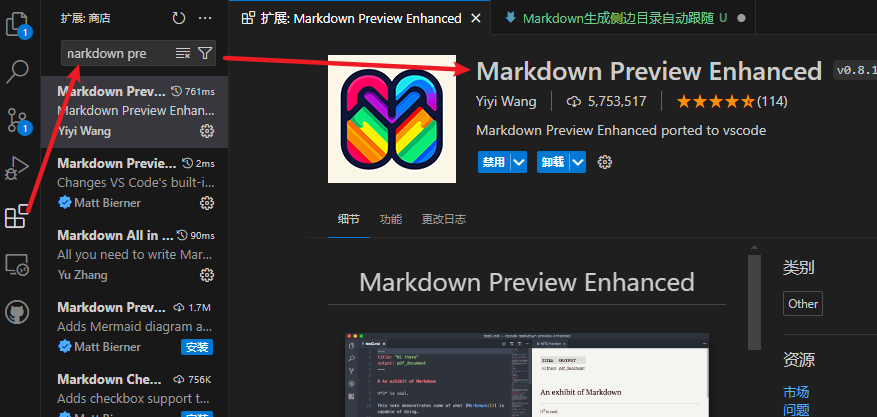
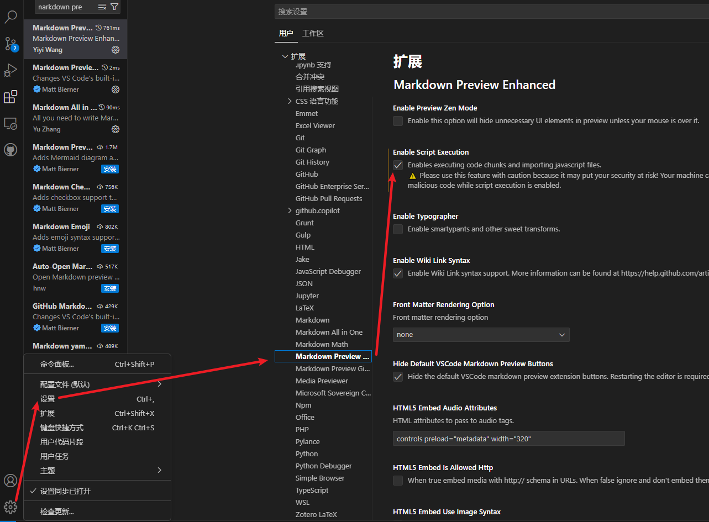
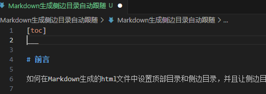
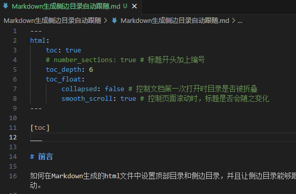
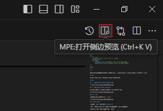
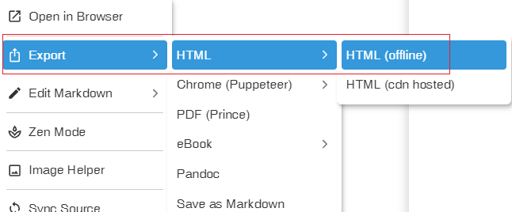
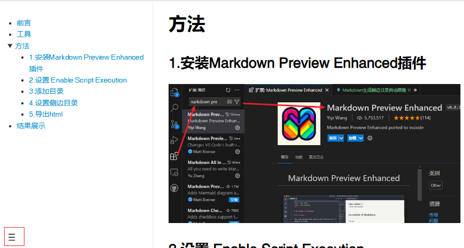

---
html:
    toc: true
    # number_sections: true # 标题开头加上编号
    toc_depth: 6
    toc_float: 
        collapsed: true # 控制文档第一次打开时目录是否被折叠
        smooth_scroll: true # 控制页面滚动时，标题是否会随之变化
--- 

[toc]

___

# 前言

如何在Markdown生成的html文件中设置顶部目录和侧边目录，并且让侧边目录自动展开。

# 工具

Visual studio Code + Markdown Preview Enhanced 插件

# 方法

## 1.安装 Markdown Preview Enhanced 插件



## 2.设置 Enable Script Execution

不论你用哪种方式，找到这个设置项，勾选上，重启VS code



## 3.添加目录

在你编写好的*.md文件头，添加`[toc]`



## 4.设置侧边目录

在md文件开头添加以下内容，**注意缩进**

每项是什么意思，我都注释出来了，根据你的需要自行决定是否需要，[参考资料](https://bookdown.org/qiushi/rmarkdown-guide/html-document.html#%E7%9B%AE%E5%BD%95%E5%92%8C%E6%A0%87%E9%A2%98)。

注意：`toc_float:`后面是不需要加`true`的

```html
---
html:
    toc: true
    # number_sections: true # 标题开头加上编号
    toc_depth: 6
    toc_float:
        collapsed: false # 控制文档第一次打开时目录是否被折叠
        smooth_scroll: true # 控制页面滚动时，标题是否会随之变化
--- 
```



## 5.导出html

打开MPE预览



在预览页面，右键菜单中，依次点击这几项



# 结果展示

注意：展开或者折叠侧边目录的按钮在左下角



 暂未解决的问题

* `smooth_scroll: true`这个设置没起作用