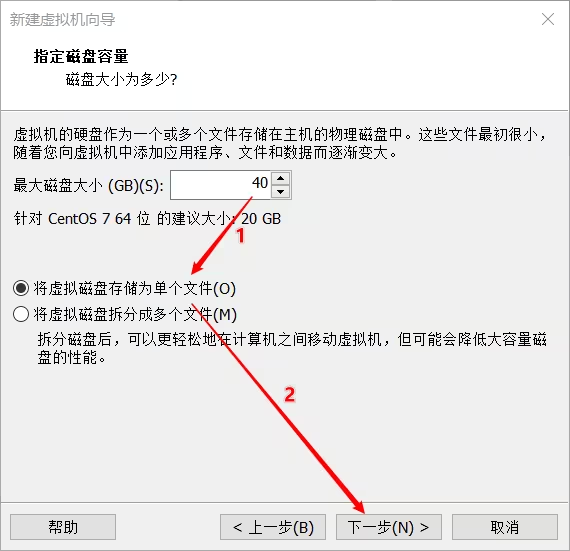
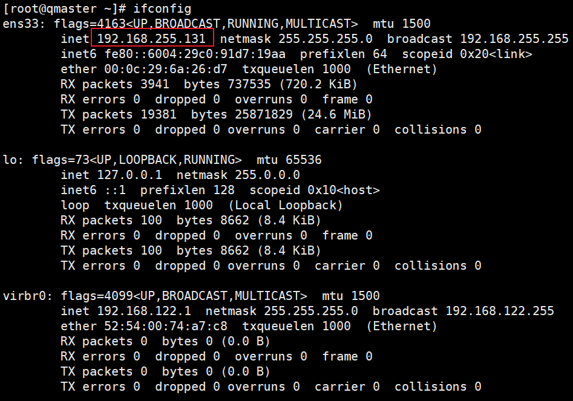

---
html:
    toc: true
    # number_sections: true # 标题开头加上编号
    toc_depth: 6
    toc_float:
        collapsed: false # 控制文档第一次打开时目录是否被折叠
        smooth_scroll: false # 控制页面滚动时，标题是否会随之变化
--- 

# SGE安装部署完整过程-基于CentOS7

[toc]

---

## 前言

把多台服务器组成一个cluster集群（Sun Grid Engine, SGE），把一台电脑上的home文件夹共享给其他服务器（NFS），公用一个home文件夹，进行统一的用户管理（NIS）。

操作系统镜像选用CentOS-7-x86_64-DVD-2009.iso，在vmware虚拟出来的服务器进行模拟。

Sun Grid Engine下载地址，https://arc.liv.ac.uk/downloads/SGE/releases/8.1.9/
sourceforge上也有，下载地址：https://sourceforge.net/projects/gridengine/files/SGE/releases/8.1.9/
（后续教程中也有相关内容，不需要提前下载）。

---

## 1 系统安装

### 1.1 安装控制节点

1）新建虚拟机


2）选择对应的操作系统文件


3）修改为自己定义的系统名称，以区分不同机器


4）硬盘值修改大一些，不够用的话，后期可以再添加的


5）网络适配器默认NAT即可，也可设置微桥接模式，只要保证在同一个网段即可（如192.168.255.xxx）


6）移动光标选择Install CentOS 7，按Enter键


7）如果有这个提示，按Enter键就可开始安装系统


8）语言默认英文即可


9）设置时区


10）点击中国区域，地址显示shanghai（上海）即可


11）设置安装选项


12）安装图形界面，并勾选**Development** 开发工具（**如果你需要用qmon配置管理集群，需要图形界面**）


13）设置硬盘分区选项


14）自动配置分区即可，也可以自定义分区


15）设置KDUMP


16）关闭kdump


17）网络设置


18）打开网络，点击OFF，ON蓝色背景亮起，下边出现IP地址表示已打开网卡（此处也可以自定义网络地址和host name，后边我们还会设置的）


19）现在我们开始安装，点击Begin Installation


20）安装过程中，我们现在可以设置root账户的密码


21）密码自己要记住


22）安装完点Reboot


23）重启之后就进入启动界面了，第一项就可以，不用管它


24）重启后需要让我们接受许可


25）接受许可


26）完成配置设置


27）之后一路NEXT点下去，到这里会让你设置一个普通账户。也可以在前边步骤就添加一个账户


28）设置一个较为复杂的密码，自己要记住密码


29）进入桌面后，右键菜单里，点击Open Terminal


30）切换到root账户,输入对应的密码。输密码不会显示任何东西，你输入前边设置的root对应的密码就可以，输完按Enter键。如果输错了多按一会退格键就可以删了

```bash
su root
```


至此，master主机的系统安装完成。

### 1.2 安装计算节点

#### 1.2.1 安装计算节点-01

1）新建虚拟机


2）选择同样的操作系统文件


3）修改文件名为计算节点，我们会有多个计算节点，所以还是编个号吧


4）硬盘大小我们也设置为40G



5）网络设置保持与master一致(都是NAT模式，默认就是同一网段）


6）移动光标选择Install CentOS 7，按Enter键


7）如果有这个提示，按Enter键就可以


8）默认英文即可


9）设置时区


10）点击中国区域，显示shanghai（上海）即可


11）设置安装选项


12）此处选择Compute Node,同时也勾选上Development Tools（开发工具）


13）设置硬盘分区选项


14）默认自动分配即可


15）设置KDUMP


16）关闭kdump


17）设置网络


18）点击OFF后，ON蓝色背景亮起，下边出现IP地址表示已打开网卡


19）点击Begin Installation，开始安装系统


20）安装过程中，我们设置root账户的密码


21）设置root密码，记住牢记。可以和master的密码一样


22）安装完，点击Reboot（重启）。不需要添加其他账户。


23）重启之后，输入root账户和对应的密码


24）显示这个，就是成功进入系统了。至此这台计算节点也安装好了


#### 1.2.2 安装计算节点-02

再建一台计算节点，步骤与compute-01一样，参见1.2.1步骤


### 1.3 安装投递节点

与计算节点方法，把特定计算节点设置为投递节点

### 1.4 修改yum源

查看系统版本

```bash
cat /etc/redhat-release
```

返回系统信息，此处以你自己的版本为准

```
CentOS Linux release 7.9.2009 (Core)
```

对于centos7.9 2009系统，执行以下命令，替换yum源（参考[资料](https://mirrors.tuna.tsinghua.edu.cn/help/centos-vault/)）

```
sed -e "s|^mirrorlist=|#mirrorlist=|g" \
    -e "s|^#baseurl=http://mirror.centos.org/centos/\$releasever|baseurl=https://mirrors.tuna.tsinghua.edu.cn/centos-vault/7.9.2009|g" \
    -e "s|^#baseurl=http://mirror.centos.org/\$contentdir/\$releasever|baseurl=https://mirrors.tuna.tsinghua.edu.cn/centos-vault/7.9.2009|g" \
    -i.bak \
    /etc/yum.repos.d/CentOS-*.repo
```

更新软件包缓存

```
yum makecache
```

## 2 NFS共享存储

利用nfs，实现在每台服务器拥有同样的目录和文件。

我们共享两个目录，server端的/home目录，以便每个服务器都有同样的家目录；另一个是/opt/sge用于安装SGE。

### 2.1 Server端（master）

1）关闭防火墙，并禁止开机启动

```bash
systemctl stop firewalld.service
systemctl disable firewalld.service
```

2）关闭selinux，将SELINUX=enable(或enforcing)修改为SELINUX=disable

```bash
vi /etc/selinux/config
```


3）重启服务器，selinux不容易直接关闭，重启关闭最有效

```bash
init 6
```

4）重启后，在这个界面点击 Not listed？


5）输入root，以及对应的密码，就可以直接进入root账户。进去之后再次打开terminal界面


6）在主控节点服务器，即master主机上安装nfs服务，同时需要安装RPC服务。

```bash
yum install -y nfs-utils rpcbind
```

7）rpcbind开机启动和开启服务

```bash
systemctl enable rpcbind.service
systemctl start rpcbind.service
```

8）查看当前主机的ip地址

```bash
ifconfig
```



此处显示ip地址为:192.168.255.131

9）设置要共享的目录，向地址为192.168.255开头的服务器共享
（在虚拟机中，NAT网络中的所有主机ip是在一个网段的，看了本机ip，就知道其他主机的ip是什么区段了），根据自己的服务器地址区段进行设置，也可以直接向所有服务器共享，将（192.168.255.0/24）替换成（\*），不含括号。

```bash
mkdir /opt/sge
vi /etc/exports
```

添加以下内容

```
/home *(rw,insecure,no_all_squash,sync,no_root_squash)
/opt/sge *(rw,insecure,no_all_squash,sync,no_root_squash)
```

10）nfs开机启动和开启服务

```bash
systemctl enable nfs
systemctl start nfs
```

11）生效export

```bash
exportfs -av
```

### 2.2 客户端（compute-01）

1）关闭防火墙

```bash
systemctl stop firewalld.service
systemctl disable firewalld.service
```

2）关闭selinux，将SELINUX=enable(或enforcing)修改为SELINUX=disabled

```bash
vi /etc/selinux/config
```


3）重启服务器，selinux不容易直接关闭，重启关闭最有效

```bash
init 6
```

4）安装rpcbind和nfs，开机启动和启动服务

```bash
yum -y install nfs-utils rpcbind
systemctl enable rpcbind.service
systemctl start rpcbind.service
systemctl enable nfs
systemctl start nfs
```

5）设置自动挂载，tab分隔符，不是空格。其中192.168.255.131是master主机的ip地址，此处替换为你自己的master主机的ip地址

```bash
mkdir /opt/sge
vi /etc/fstab
```

在原始文件最下边添加

```
192.168.255.131:/home	/home	nfs	defaults	0	0
192.168.255.131:/opt/sge	/opt/sge	nfs	defaults	0	0
```

修改后的内容如下所示，**原始内容不要进行任何修改，否则会开不了机，此处一定要写对了**


6）挂载

```bash
mount -a
```

7）查看是否挂载上

```bash
df -h
```

可以看到 `/home`和 `/opt/sge`都挂载上了


### 2.4 投递节点

投递节点参考客户端进行安装，不再叙述。

## 3 NIS(Network Information Service)安装部署

### 3.1 Server端（master）

1）安装相关库

```bash
yum -y install ypserv ypbind yp-tools
```

2）配置NIS domain，增加NISDOMAIN和启用端口，life.com应该也可以替换为其他域名

```bash
vi /etc/sysconfig/network
```

```
NISDOMAIN=life.com
YPSERV_ARGS="-p 1011"
```

3）开机自动加入NIS域

```bash
vi /etc/rc.d/rc.local
```

```
/bin/nisdomain life.com
```

4）设置NIS服务器访问权限

编辑NIS配置文件，允许特定的主机访问NIS服务器，可以是特定的ip，也可是特定网段，此处我设置的是所有主机均可访问。

```bash
vi /etc/ypserv.conf
```

直接删除最下边一行前边的#即可

```
 * :	*	:	*	:	none
```


5）让yppasswdd启动在固定端口

```bash
vi /etc/sysconfig/yppasswdd
```

```
YPPASSWDD_ARGS="--port 1012"
```

6）设置开机启动和启动服务，确保先启动rpcbind再启动ypserv

前边我们已经启动了rpcbind

```bash
systemctl enable ypserv.service
systemctl enable yppasswdd.service
systemctl start ypserv.service
systemctl start yppasswdd.service
```

7）建立数据库，使NIS服务器端的用户信息导入。当用户信息更新后，也需要重新执行该命令更新数据库。ctrl+D键结束输入，输入y后按Enter键完成设置。

```bash
/usr/lib64/yp/ypinit -m
```

8）在server端新增账户或者删除账户或者修改账户信息后，更新NIS账户和资料库

```bash
make -C /var/yp
make -C /var/yp passwd
```

### 3.2 客户端（compute-01)

1）安装NIS相关库

```bash
yum -y install ypbind yp-tools
```

2）在网络项加入NIS域

```bash
vi /etc/sysconfig/network
```

添加以下内容

```
NISDOMAIN=life.com
YPSERV_ARGS="-p 1011"
```

3）开机自动加入NIS域

```bash
vi /etc/rc.d/rc.local
```

添加以下内容

```
/bin/nisdomainname life.com
```

4）修改用户密码的认证顺序文件，用于管理系统中多个配置文件查找的顺序

```bash
vi /etc/nsswitch.conf
```

找到这几个开头的，修改后边的内容如下

```
...
passwd:	files nis sss
shadow:	files nis sss
group:	files nis sss
...
hosts:	files nis dns
...
```

5）修改客户端配置文件，输入NIS服务器信息，替换192.168.255.131为你自己的master主机的ip地址

```bash
vi /etc/yp.conf
```

添加以下内容

```
domain life.com server 192.168.255.131
```

6）修改系统认证文件，启用nis

```bash
vi /etc/sysconfig/authconfig
```

找到USENIS这一项，修改no为yes

```
USENIS=yes
```

7）设置PAM授权，添加nis

```bash
mkdir -p /etc/pad.d/
vi /etc/pad.d/system-auth
```

添加以下内容

```
password sufficient pam_unix.so sha512 shadow nis nullok try_first_pass use_authtok
```

8）开机启动和启用服务

```bash
systemctl enable ypbind
systemctl start ypbind
```

### 3.3 投递节点

投递节点可以作为从服务器，也可以作为客户端。
此处参考客户端进行安装，不再叙述。

## 4 SGE Cluster

### 4.1 主控节点安装（qmaster）

1）修改hostname

```bash
hostnamectl set-hostname qmaster.local
```

2）修改hosts文件，添加主控节点、投递节点和计算节点（即qmaster、qsubnode、compute-01、compute-02）的信息

```bash
vi /etc/hosts
```

添加以下内容，ip替换你自己对应的ip

```
192.168.255.131 qmaster.local qmaster
192.168.255.132 qsubnode.local qsubnode
192.168.255.130 compute01.local compute01
192.168.255.133 compute02.local compute02
```


3）设置SGE_ROOT环境变量，并生效。

`/opt/sge/bin/lx-amd64`目录现在还不存在，后边安装完SGE就有了

```bash
vi /etc/profile
```

添加以下内容

```
export SGE_ROOT=/opt/sge
export PATH=/opt/sge/bin/lx-amd64:$PATH
```

激活环境变量

```bash
source /etc/profile
```

4）安装epel源

```bash
yum -y install epel-release
```

5）安装依赖库

```bash
yum -y install jemalloc-devel openssl-devel ncurses-devel pam-devel libXmu-devel hwloc-devel hwloc hwloc-libs java-devel javacc ant-junit libdb-devel motif-devel csh ksh xterm db4-utils perl-XML-Simple perl-Env xorg-x11-fonts-ISO8859-1-100dpi xorg-x11-fonts-ISO8859-1-75dpi
```

6）添加sgeaddmin用户组和sgeadmin用户

```bash
groupadd -g 490 sgeadmin
useradd -u 495 -g 490 -m -d /home/sgeadmin -s /bin/bash -c "SGE Admin" sgeadmin
```

7）下载编译SGE

```bash
# wget https://arc.liv.ac.uk/downloads/SGE/releases/8.1.9/sge-8.1.9.tar.gz #这个链接已经失效了
wget https://master.dl.sourceforge.net/project/gridengine/SGE/releases/8.1.9/sge-8.1.9.tar.gz
tar -zxvf sge-8.1.9.tar.gz
cd sge-8.1.9/source/
sh scripts/bootstrap.sh && ./aimk && ./aimk -man
echo Y | ./scripts/distinst -local -allall -libs -noexit
chown -R sgeadmin.sgeadmin /opt/sge/
```

8）安装SGE qmaster节点

```bash
cd $SGE_ROOT
./install_qmaster
```

9）安装过程中大部分保持默认即可，到Adding Grid Engine hosts这一步时注意


10）每次输入一个服务器的host，包括主控节点和计算节点；

如果服务器比较多，跳到第[14](#step14)步骤看


11）每输完一个，然后按Enter键，又回到这个界面，输入下一个服务器的host


12）继续添加其他主机


13）所有的服务器的host输入完毕后，下次直接按Enter键，即结束host添加


`<span id="step14">`14）如果服务器较多，一次次的输入很麻烦，我们可以提前将这些服务器的host写入到一个hostlist文件

注意hostlist文件需要在当前$SGE_ROOT目录下

```bash
vi hostlist
```

```
qmaster.local
qsubnode.local
compute01.local
compute02.local
```

15）在Adding Grid Engine hosts这一步，输入y，然后按Enter键


16）输入hostlist，然后按Enter键，完成添加。


17）之后一致保持默认即可，完成SGE qmaster安装。

18）修改@allhost组，删除原有的NONE，添加所有计算节点的host

```bash
qconf -mhgrp @allhosts
```

```
group_name @allhosts
hostlist compute01.lcoal compute02.local
```


19）开启任务调度信息收集

```bash
vi /opt/sge/default/common/sched_configuration
```

修改 `schedd_job_info` 后边为 `true`


~~20）如果在qmaster上安装执行程序，让qmaster也可以提供计算服务，保持默认选项安装。不建议这样做~~

```bash
./install_execd
cp /opt/sge/default/common/settings.sh /etc/profile.d/
cp /opt/sge/default/common/settings.csh /etc/profile.d/
source /etc/profile.d/settings.sh
```

~~21）添加投递节点，将qmaster节点设置为任务投递节点~~

```bash
qconf -as qmaster.local
```

### 4.2 执行节点安装（compute-01)

1）安装依赖库

```bash
yum -y install hwloc-devel
```

2）修改hostname

```bash
hostnamectl set-hostname compute01.local
```

3）修改host文件，添加主控节点和计算节点信息。也可将master上hosts文件复制，参考scp命令

```bash
vi /etc/hosts
```

```
192.168.255.131 qmaster.local qmaster
192.168.255.132 qsubnode.local qsubnode
192.168.255.130 compute01.lcoal compute01
192.168.255.130 compute02.local compute02
```

4）添加 `sgeadmin`用户组，添加 `sgeadmin`用户

**注意sgeadmin的uid与gid必须与master上的保持一致**

```bash
groupadd -g 490 sgeadmin
useradd -u 495 -g 490 -r -s /bin/bash -c "SGE Admin" sgeadmin
```

5）添加 `SGE_ROOT`环境变量

```bash
vi /etc/profile
```

```
export SGE_ROOT=/opt/sge
export PATH=/opt/sge/bin/lx-amd64:$PATH
```

使环境变量生效

```bash
source /etc/profile
```

6）安装计算节点

```bash
cd $SGE_ROOT
./install_execd
cp /opt/sge/default/common/settings.sh /etc/profile.d/
cp /opt/sge/default/common/settings.csh /etc/profile.d/
source /etc/profile.d/settings.sh
```

7）运行 `qhost`命令，我们就能成功看到compute01及其信息在队列中，说明安装成功


### 4.3 其他执行节点

（compute-02）安装配置，参考compute-01的安装配置过程。

### 4.4 投递节点

投递节点参考执行节点进行安装，不再叙述。

### 4.5 qmon设置

* 命令行输入 `qmon`命令，就可以打开qmon图形界面
  
* 选择“Host Configuration”，在其中设置管理节点、投递节点、执行节点
  
  
* “Cluster Queues”选项中，可以设置all.q队列是否包含投递节点
  

## 5 测试

1）在master上新建一个普通用户，投递任务进行测试

新建用户test，并设置密码

```bash
useradd -m test
passwd test
```

2）更新NIS数据库

```bash
make -C /var/yp
make -C /var/yp passwd
```

3）登陆test用户

4）测试一下集群是否能正常工作

```bash
vi test.csh
```

```
#!/bin/bash
#$ -cwd
#$ -S  /bin/bash
#$ -l h_vmem=1G
#$ -j  y
#$ -V
#$ -q all.q
uname -a >test.txt
```

```bash
qsub test.csh
```

如果出现错误无法分配内存，是因为计算节点的内存太小了。

## 6 讨论

* 系统安装过程，可根据自己的实际情况进行相应变化。
* 在虚拟机中大多数命令不容易复制，建议安装完系统后，用ssh登陆软件进行操作
* 防火墙会影响服务的运行，确保防火墙关闭。用 `systemctl status service_name`可查看服务运行状态
* 多个文件在不同服务器上是重复的，可用 `scp`复制过去
* master节点是否该分配到执行节点？建议不要这么做，以免系统压力过大，造成集群瘫痪
* qmon在图形界面配置集群较为方便。qmon如果启动不了，基本上是字体库的问题，查看字体库是否安装。参考资料中存在错误
* 真的在机房部署SGE，可能需要考虑更多的问题，尤其是防火墙。（为了更为方便的安装部署，我把防火墙关闭了）
* 为了简化教程，还有好多知识点我没有提及。建议自己搜索学习
* 如有其他问题，欢迎一起讨论！

## 7 参考资料

https://github.com/wangkaisine/SGE-On-CentOS

https://blog.csdn.net/wuxianfeng1987/article/details/72874905?utm_medium=distribute.pc_relevant.none-task-blog-BlogCommendFromBaidu-5.control&depth_1-utm_source=distribute.pc_relevant.none-task-blog-BlogCommendFromBaidu-5.control

http://www.zxzyl.com/archives/1057

https://blog.csdn.net/qq_41959899/article/details/105948440

https://www.cnblogs.com/zhushuaishuai/p/10843379.html
