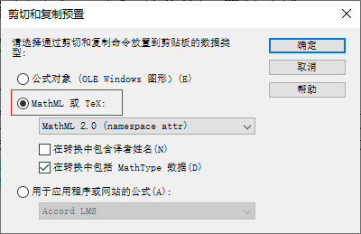

---
html:
    toc: true
    # number_sections: true # 标题开头加上编号
    toc_depth: 6
    toc_float:
        collapsed: false # 控制文档第一次打开时目录是否被折叠
        smooth_scroll: true # 控制页面滚动时，标题是否会随之变化
---

[toc]

---

# 前言

如果你复制MathType中的公式到word，设置了“记住我的选项”，后续又想让它恢复提醒，该如何修改呢？

---

# 解决办法

## 方法一

打开word，点击MathType选项卡，点击最右下角的下拉箭头，出现一个提示框，选择“**每次粘贴时提醒**”。

这样再次粘贴就会弹出让你选择哪种公式的提示框了。

如果没用，看方法二

## 方法二

打开Mathtype，点击**预置 --> 剪切和复制预置**。

在弹出的选项框中，如果你设置的是“**公式对象**”，即使你按照方法一设置了，在粘贴时也不会弹出提示框的；
只有设置成“**MathML或Tex**”选项，才会在粘贴时弹出提示框。

