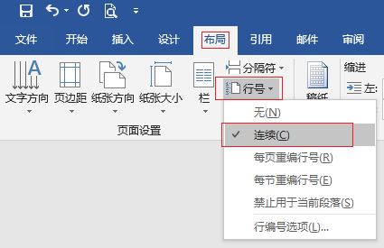
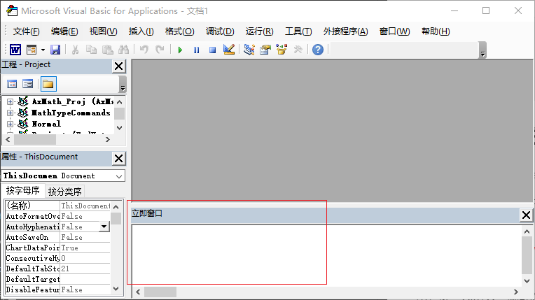

---
html:
    toc: true
    # number_sections: true # 标题开头加上编号
    toc_depth: 6
    toc_float:
        collapsed: false # 控制文档第一次打开时目录是否被折叠
        smooth_scroll: true # 控制页面滚动时，标题是否会随之变化
---

[TOC]

---

# 前言

假设我们的论文有3节，并且第二节还是横向的，怎么在全文的右侧加行号？


---

# 解决方法

## 1.添加行号【默认在左侧】

首先鼠标点到第一节任意位置，在上方选择，__布局-->行号-->连续__。

然后点到第二节任意位置，在上方选择，__布局-->行号-->连续__。

重复操作，所有节都加上行号。

（在分节之前就加上行号就不用这么麻烦的加行号了）



## 2.把行号变成右侧

需借助Microsoft visual Basic for Applications（下文简称 __VB__ ）:

（1）__Alt+F11__ 就可以打开<font color="Red">VB</font>（如果你的Alt和Ctrl设置了反转，你需要按Ctrl+F11）

（2）如果是第一次使用<font color="Red">VB</font>，在页面下方，你应该是看不见“立即窗口”的

（3）按 __Ctrl+G__ 就可以打开“立即窗口”



（4）在VB的“立即窗口”中输入以下代码，按回车：

```VBA
ActiveDocument.PageSetup.SectionDirection = wdSectionDirectionRtr
```
（5）这样你的文章的行号就都在右侧了，那个VB也可以关闭了。

## 3.把行号换回左侧【按需使用】

同理，如果想把行号再换回左侧，在VB的立即窗口中输入以下代码：

```VBA
ActiveDocument.PageSetup.SectionDirection = wdSectionDirectionLtr
```

## 4.扩展

网上的教程代码大部分是这样的：

```VBA
ActiveDocument.Sections(1).PageSetup.SectionDirection = wdSectionDirectionRtr
```

其中的 ***ActiveDocument*** 代表当前打开的文档，所以加行号时，最好只打开一个文档；

其中的 __*Sections(1)*__ 代表第一节内容；如果将其改成 __*Sections(2)*__ 代表第二节内容。这样你就明白了，为什么你只能把第一节的行号改到右侧，而其他节改不了。 
