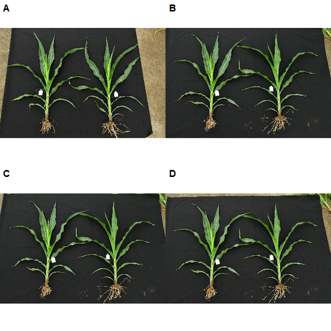
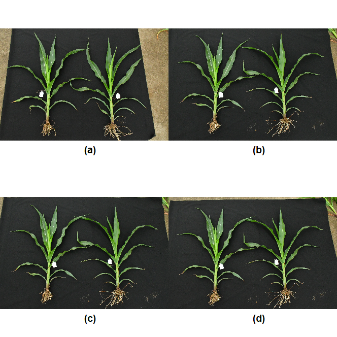

---
html:
    toc: true
    # number_sections: true # 标题开头加上编号
    toc_depth: 6
    toc_float:
        collapsed: false # 控制文档第一次打开时目录是否被折叠
        smooth_scroll: true # 控制页面滚动时，标题是否会随之变化
---

[TOC]

如何将本地的图片，读入R中，再给拼接成一张图。这里给出代码：

## 安装软件包

```r
install.packages("magick")
install.packages("ggpubr")
```

## 拼图片

```r 
library(magick)
library(ggpubr)
p1 <- image_read("img1.jpeg")
p2 <- image_read("img2.jpeg")
p3 <- image_read("img3.jpeg")
p4 <- image_read("img4.jpeg")
 
pp1 <- image_ggplot(p1, interpolate = FALSE)
pp2 <- image_ggplot(p2, interpolate = FALSE)
pp3 <- image_ggplot(p3, interpolate = FALSE)
pp4 <- image_ggplot(p4, interpolate = FALSE)

# 画图样式1
ggarrange(pp1,pp2,pp3,pp4, labels = "AUTO")

# 画图样式2
ggarrange(pp1,pp2,pp3,pp4, labels = c("(a)","(b)","(c)","(d)"),label.x = 0.5,label.y = 0,hjust = 0,vjust = -2)
```

之后，你就可以用你喜欢的任何形式来保存拼接好的图片。


## 结果展示

画图样式1



画图样式2



需要更精细地调整图片，可以查阅这两个R包的使用说明。