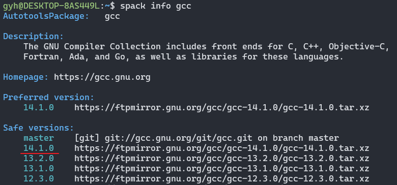
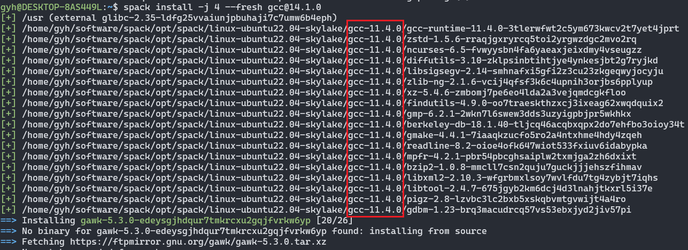
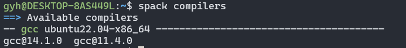
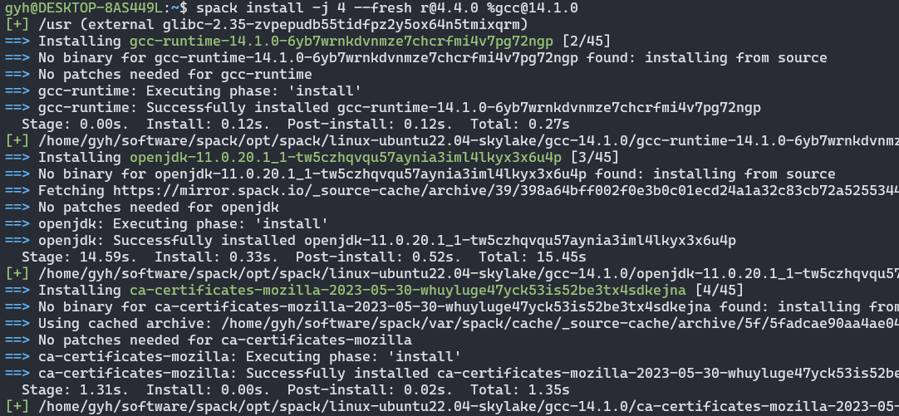
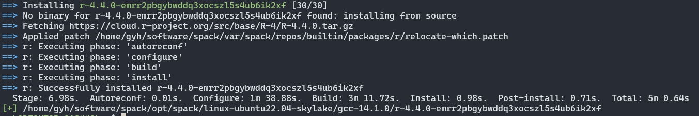
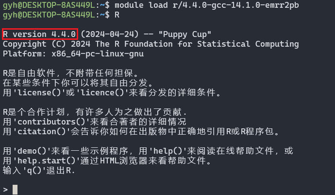

---
html:
    toc: true
    # number_sections: true # 标题开头加上编号
    toc_depth: 6
    toc_float:
        collapsed: false # 控制文档第一次打开时目录是否被折叠
        smooth_scroll: true # 控制页面滚动时，标题是否会随之变化
---

[TOC]

## 前言
之前的博客中，我介绍了怎么[安装Spack和EnvironmentModules，两者搭配，可以轻松解决环境依赖的问题](http://t.csdnimg.cn/Dvot4)。

最近，实验室有同学需要用最新版`R`，我安装的过程中又遇到依赖包不兼容的问题。经过一番折腾，终于弄明白了。
在这里，我以安装最新版`R 4.4.0`为例，进一步讲解为什么会出现依赖不兼容的问题。

## 正文

### 一、安装最新版gcc

#### 1.首先查看当前最新版gcc版本

```bash
spack info gcc
```



可以看到是`gcc 14.1.0`

#### 2.安装`gcc 14.1.0`

- `-j 4`参数，允许多线程安装。
- `--fresh`选项：Spack默认安装软件时，会尽可能用已经存在的依赖，以高效安装过程；加上`--fresh`参数，Spack就会重新编译，安装最新的依赖和配置。[官方说明](https://spack.readthedocs.io/en/latest/basic_usage.html#reusing-installed-dependencies)

```bash
spack install -j 4 --fresh gcc@14.1.0
```


观察输出的这些内容，可以看到前几项依赖是已经有的，Spack就不会再安装了。而且，注意，这几项依赖包是由`gcc 11.4.0`编译的，并且我的系统里只安装了`gcc 11.4.0`。

如果遇到无法下载的问题，参考[2.2](#2解决无法下载的问题)说明。（因为在这步我确实没有遇到问题）

#### 3.更新Spack编译器

将刚安装的`gcc 14.1.0`添加到Spack的编译器列表中

```bash
# 版本最后的hash值因人而异，用TAB键自动补全
module load gcc/14.1.0-gcc-11.4.0-ctwe2zd

spack compiler find
spack compilers
module purge # 等效于 unload 所有软件
```



### 二、安装新版R

#### 1.安装`R 4.4.0`

```bash
spack install -j 4 --fresh r@4.4.0 %gcc@14.1.0
```

参数说明：

- `-j 4`：允许多线程安装。
- `--fresh`：不重用已有的依赖。
- `r@4.4.0`：`@`后跟版本号，指定安装的版本。
- `%gcc@14.1.0`：`%`后跟编译器和版本，指定使用特定的编译器。
- 只有指定`--fresh`，才会用我们指定的`gcc`来编译；否则，有可能会用已有的其它版本的依赖，导致依赖不兼容，无法正常使用。



可以看到，这次安装没有使用已存在的依赖，都是安装的最新依赖。而且时间很长。

#### 2.解决无法下载的问题

如果遇到无法下载的包，像`jdk`这种需要License的包或者一些在`github`上的包，在合适的网络环境重新安装，或者，参考[手动安装](https://spack.readthedocs.io/en/latest/basic_usage.html#non-downloadable-tarballs)和[离线镜像安装](https://spack.readthedocs.io/en/latest/mirrors.html#mirrors)。

我在安装的时候就遇到了pcre2不能下载的问题。（明明其它的github的包都能正常下载）

(1) 创建一个镜像文件夹，用来存放需要手动安装的软件包

```bash
mkdir ~/.spack/manual_mirror
```

(2) 通过编辑`~/.spack/mirrors.yaml`文件，注册镜像

```
mirrors:
  manual: file://~/.spack/manual_mirror
```

(3) 将你的tar压缩包放进去。路径格式`<package>/<package>-<version>.tar.gz`(tar.xz, tar.bz2, tgz也是可以的)，例如：

```bash
$ ls -l ~/.spack/manual_mirror/pcre2/
-rw-r--r-- 1 gyh gyh 2522928 Feb 17 01:14 pcre2-10.43.tar.gz
```

(4) 继续安装
```bash
spack install -j 4 --fresh r@4.4.0 %gcc@14.1.0
```

这下终于装好了：



#### 3.加载R
```bash
module load r/4.4.0-gcc-14.1.0-emrr2pb
R
```

完美收工：



用到的所有离线镜像包我打包放到了评论区。