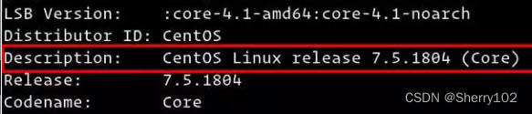
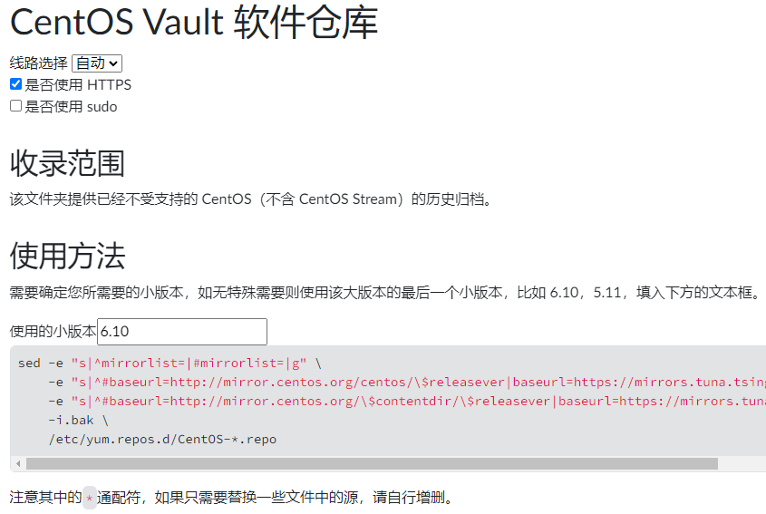
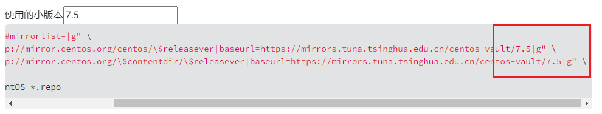
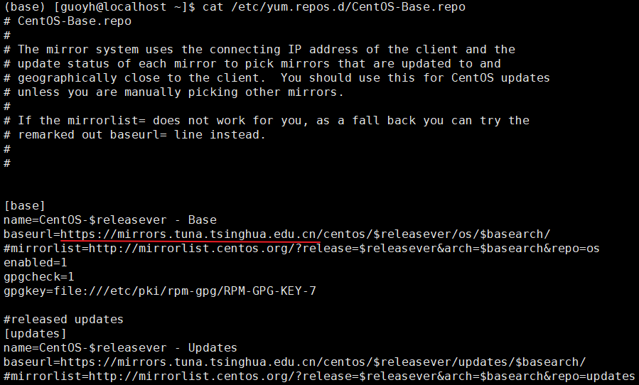

---
html:
    toc: true
    # number_sections: true # 标题开头加上编号
    toc_depth: 6
    toc_float:
        collapsed: false # 控制文档第一次打开时目录是否被折叠
        smooth_scroll: true # 控制页面滚动时，标题是否会随之变化
---

[toc]

如果你在Centos系统上使用`yum install`安装软件，出现了网络连接失败之类的错误，是因为Centos已经停止了维护，默认的安装源也已经失效。

如果你也换源了，但是可能查的是比较旧的内容，那些内容也已经不适用了。

现在的解决办法是需要更换为Vault源。

## 1.检查你当前系统的小版本

```bash
lsb_release -a
```

结果类似这样，则小版本号是7.5



## 2.更换镜像

这里我们选择用清华vault镜像，其它国内的vault镜像基本大同小异。
打开[清华镜像](https://mirrors.tuna.tsinghua.edu.cn/help/centos-vault/)的网页https://mirrors.tuna.tsinghua.edu.cn/help/centos-vault/

默认网页内容如下：




修改其中的数字为在第一步得到的结果，**注意是小版本号**，这里比如说是7.5,
注意到末尾的数字也变了



## 3.修改镜像源

粘贴上面的内容，到你的Centos的终端（Terminal）中，并执行，就会自动替换成清华的镜像。

修改后的源文件内容大致如下：



最后，更新软件包缓存

```bash
yum makecache
```