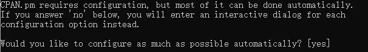
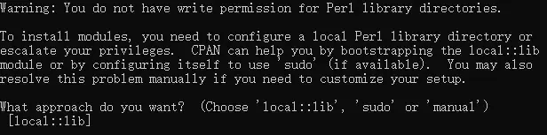
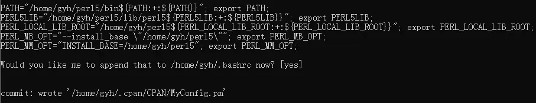
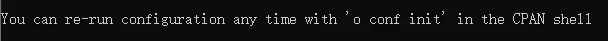

---
html:
    toc: true
    # number_sections: true # 标题开头加上编号
    toc_depth: 6
    toc_float:
        collapsed: false # 控制文档第一次打开时目录是否被折叠
        smooth_scroll: true # 控制页面滚动时，标题是否会随之变化
---

[toc]

---

# 一、前提工作

1、确保系统上安装了*make*

2、管理员身份安装*local::lib*

```bash
su root # 切换root
cpan
install local::lib
```

如果你的系统已经有这两个了，就不用麻烦管理员了。

# 二、非root用户操作

1、进入cpan shell

```bash
cpan
```
2、如果是第一次使用cpan

会提示你是否自动创建配置，选择yes（默认选项），直接回车



3、然后提示你，非管理员应该用*local::lib*（也是默认选项），直接回车



4、然后提示你，一些perl相关的环境变量是否写入 *.bashrc* 中，选择yes（默认选项），直接回车。



这样，以后你就可以直接用cpan安装你想装的模块了，默认位置是在*home*目录下的*perl5*中。

# 三、重置配置

如果你想重新配置，或者需要将***sudo***模式和***local::lib***模式转换，进入cpan Shell后

输入

```bash
o conf init
```

就可以重新配置。

这一点在配置cpan结束时，官方也说明了：

